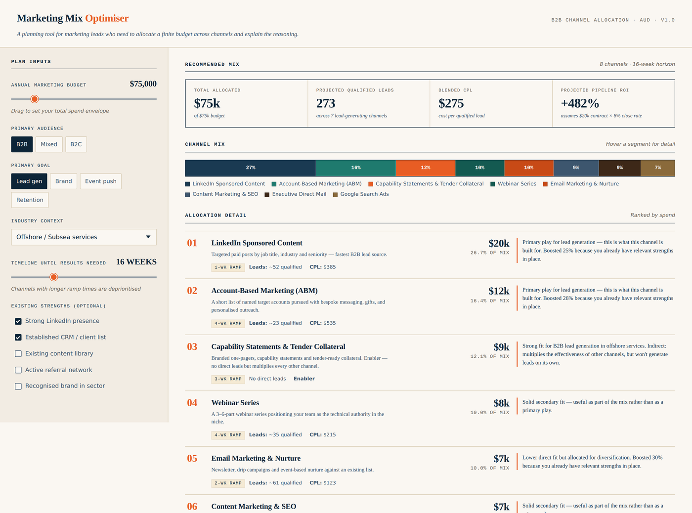

# 04 — Marketing Mix Optimiser

> An offline interactive planning tool for marketing leads: enter your budget, audience, goal, industry and timeline — get a recommended channel mix with allocations, projected leads, blended cost-per-lead, a 90-day execution roadmap, and a sensitivity view. One file. No install. Double-click to run.

Built as a portfolio piece that bridges my Information Technology background to commercial &amp; marketing thinking — taking a problem a marketing operations analyst would normally work in Excel and turning it into a self-explaining interactive tool.



---

## Why this exists

When a small marketing team is handed a budget — "you have $75k for the next 16 weeks, generate leads for our offshore inspection service" — the question is not *can we spend it*, but *which mix of channels gets the most qualified pipeline given our timeline, our strengths, and how the industry actually buys*.

That decision usually lives in someone's head, or in a half-finished Excel model that nobody else can interpret. It involves real economics: channel cost-per-lead benchmarks, minimum viable spend per channel (you cannot do a $200 conference activation), ramp time before a channel produces results, and diminishing returns inside a single channel.

I built this tool to put that reasoning in one place — and to make every recommendation auditable, so a marketing lead can sense-check the model before acting on it.

The brief I gave myself was deliberately strict:

1. **Genuinely useful** — outputs that a real marketing analyst would recognise, not generic "spend more on social"
2. **Runs entirely offline** — no install, no API key, no internet. Open `index.html` and it works on any laptop, anywhere.
3. **Auditable** — every channel allocation comes with a one- or two-sentence rationale, so the user can see *why* the model recommended what it did
4. **Honest about limits** — the README and the tool itself surface the assumptions baked into the numbers

## One-step demo

```
Open commercial-marketing-portfolio/04-marketing-mix-optimiser/index.html in any browser.
```

That's it. No pip, no npm, no build step, no internet connection required. The full app — UI, channel catalog, allocation engine, charts, recommendations — is a single self-contained HTML file.

## What it does

1. **Takes six inputs** from the planner — budget, primary audience (B2B / Mixed / B2C), primary goal (Lead gen / Brand / Event push / Retention), industry context, timeline in weeks, and any optional existing strengths (strong LinkedIn presence, established CRM, content library, referral network, recognised brand)
2. **Scores 12 marketing channels** against those inputs using a weighted multi-factor fit model — see the algorithm section below
3. **Allocates the budget** in a two-pass constrained allocation — first locking channels that would exceed their per-channel cap, then dropping channels that cannot clear their minimum viable spend
4. **Projects qualified leads** for each channel using a diminishing-returns curve so the model doesn't naïvely assume $2× spend produces $2× leads
5. **Renders a full plan** — channel mix bar chart, per-channel allocation cards with rationale, a 90-day phased execution roadmap, and a sensitivity panel showing what happens if the budget were doubled or halved

## The allocation algorithm — the interesting part

A naïve allocator — "give the most money to the channel with the best fit score" — collapses into single-channel plans that ignore caps, minimums, and timing. What works is a four-stage pipeline:

### Stage 1 — Filter for feasibility

A channel is dropped before scoring if:

- Its **minimum viable spend** is greater than what the channel could plausibly receive (`budget × max_share × 1.2`). A $25k conference is not in scope on a $15k total budget.
- Its **ramp time** exceeds the available timeline by more than two weeks. A 12-week SEO content build is not the play when the user needs results in four weeks.

### Stage 2 — Score each remaining channel

```
score = fit  ×  strength_boost  ×  cpl_score  ×  timeline_fit  ×  primary_boost

where:
  fit            = audience_fit × goal_fit × industry_fit   (each 0–1)
  strength_boost = 1.0 to 1.5,  applied per user-declared strength (e.g. strong LinkedIn → 1.25 on LinkedIn Ads)
  cpl_score      = clamp(300 / channel_cpl, 0.7, 1.3)       (dampened so CPL informs but doesn't dominate)
  timeline_fit   = 1.0 if slack ≥ 4 weeks, 0.7 if slack ≥ 0, 0.3 if negative
  primary_boost  = 1.4  only if goal_fit ≥ 0.95 AND fit ≥ 0.35   (gated so B2B-heavy channels don't dominate B2C plans)
```

The `primary_boost` gate was the most-tuned part of the algorithm. Without the gate, channels built for one specific goal (e.g. conferences for event push) leak into plans where they don't belong; with the gate they only get the boost when the user's goal genuinely aligns.

Channels scoring at or below 0.15 are dropped — they would be allocation noise.

### Stage 3 — Two-pass constrained allocation

Channels above the score threshold are then allocated budget in two passes:

| Pass | Constraint | What it does |
|---|---|---|
| **A — Caps** | No channel exceeds `budget × max_share` | Iteratively locks any channel whose proportional allocation would exceed its cap (e.g. content marketing capped at 25% of budget), redistributing the surplus across remaining channels |
| **B — Floors** | Every kept channel clears its `min_spend` | Iteratively drops the lowest-scoring channel that cannot meet its minimum, redistributing its budget across the survivors, until all remaining channels clear their floor |

The two-pass structure is deliberate. Caps-then-floors prevents the model from spreading the budget so thin that several channels end up below minimum spend and the user is told to do four things, none of them properly funded.

### Stage 4 — Project leads with diminishing returns

For each lead-generating channel:

```
leads = √(allocation / min_spend) × (min_spend / cpl)
```

At minimum spend, this returns the baseline lead count. At 4× minimum spend, it returns 2× baseline leads — not 4×. This reflects the real-world observation that doubling LinkedIn spend on the same audience does not double the qualified leads — saturation, audience exhaustion, and creative fatigue all kick in.

Enabler channels (capability statements, PR) are explicitly modelled as producing no direct leads — they multiply the effectiveness of other channels but are not lead-generating in their own right. This is noted in their rationale.

### Pipeline ROI is conservative

The Projected Pipeline ROI metric assumes **$20,000 average contract value × 8% close rate** on qualified leads. Both numbers are intentionally conservative — they're disclosed at the bottom of the UI so the user can apply their own values. A more optimistic model would show triple-digit ROI on almost every plan, which would be flattering and dishonest.

## Channel catalog

Twelve channels are modelled, calibrated to Australian B2B marketing benchmarks (AUD):

| Channel | Min spend | Typical CPL | Ramp | Max share | Best for |
|---|---:|---:|---:|---:|---|
| Industry conference exhibition | $22k | $580 | 8 wks | 45% | B2B brand + event push |
| LinkedIn Sponsored Content | $2.5k | $135 | 1 wk | 30% | B2B targeted lead gen |
| Account-Based Marketing | $6k | $380 | 4 wks | 30% | High-value B2B |
| Capability statements & tender collateral | $3.5k | enabler | 3 wks | 20% | Tender support |
| Content marketing & SEO | $3k | $65 | 12 wks | 25% | Long-horizon lead gen |
| Email marketing & nurture | $1k | $45 | 2 wks | 15% | Retention + nurture |
| Trade publication advertising | $4.5k | $420 | 4 wks | 15% | Industry awareness |
| Webinar series | $2k | $110 | 4 wks | 15% | Thought leadership |
| Executive direct mail | $3.5k | $280 | 3 wks | 10% | ABM / premium accounts |
| Google Search Ads | $1.5k | $185 | 1 wk | 20% | High-intent leads |
| PR & analyst relations | $5k | enabler | 6 wks | 15% | Brand credibility |
| Industry body sponsorship | $8k | $410 | 4 wks | 15% | Network access |

The numbers are realistic but not authoritative — they're triangulated from public CPL benchmarks (HubSpot, LinkedIn marketing reports) and adjusted for the Australian industrial B2B market. The whole catalog lives at the top of `index.html` and is straightforward to retune.

## Strength multipliers

When the user declares an existing strength, a small lookup table boosts the relevant channels' scores by 1.05× to 1.30×, capped at 1.5× cumulative. This reflects the real principle that channels are easier to scale on top of an existing foundation than from a standing start.

| Strength | Boosts |
|---|---|
| Strong LinkedIn presence | LinkedIn Ads (×1.25), ABM (×1.10), Content (×1.05) |
| Established CRM / client list | Email (×1.30), ABM (×1.15), Direct mail (×1.10) |
| Existing content library | Content (×1.25), Webinar (×1.10), LinkedIn Ads (×1.05) |
| Active referral network | ABM (×1.15), Direct mail (×1.10), Sponsorship (×1.05) |
| Recognised brand in sector | PR (×1.15), Conference (×1.10), Sponsorship (×1.10) |

## What the output looks like

The interactive view renders:

- **KPI strip** — Total Allocated, Projected Qualified Leads, Blended CPL, Projected Pipeline ROI (with the underlying contract-value and close-rate assumptions shown beneath)
- **Channel mix bar** — a single horizontal stacked bar with each channel's share labelled in percent
- **Headroom advisory** — if the algorithm could not allocate more than ~90% of the budget, a callout recommends either reserving the unallocated portion for next quarter or extending the timeline rather than forcing it into a poor-fit channel
- **Channel allocation cards** — ranked by spend, each showing rank, channel name, summary, ramp tag, projected leads, channel CPL, dollar allocation, percentage of mix, and a generated rationale (1–4 sentences) explaining primary-play status, strength boost, timeline tightness, cap-hit, or enabler status
- **90-day execution roadmap** — four phases (Set up · Build · Execute · Iterate) with channel-specific actions
- **Sensitivity panel** — "if budget doubled" and "if budget halved" projections, with the biggest-mover channel called out in each direction

## Architecture

```
04-marketing-mix-optimiser/
├── README.md
├── optimiser_preview.png        Hero screenshot for this README
└── index.html                   The entire app — UI, data, engine, charts (~1100 lines)
```

The single-file structure is intentional. The cost is some code density; the benefit is that the recruiter can email the file to themselves, drop it on a USB stick, or send it as an attachment — and it works. There is no toolchain to install and nothing to break.

Internally the file is organised into clearly labelled sections:

1. **Styles** — CSS variables for the editorial palette (deep navy, cream paper, coral accent), system-font typography (Georgia for display, Helvetica Neue for body), responsive sticky-panel layout
2. **Channel catalog** — the twelve channels as a JavaScript object, each with full economics, fit scores, and a human-readable summary
3. **Strength boost map** — the lookup table above
4. **Allocation engine** — the four-stage pipeline (filter → score → allocate → project) as pure functions
5. **Rationale generator** — composes the per-channel explanation strings from the allocation result
6. **Renderer** — builds the KPI strip, channel mix bar, allocation cards, roadmap, and sensitivity panel from the engine output
7. **Input wiring** — re-runs the engine and re-renders on every input change

## Known limitations

I want this README to be honest about what this is and isn't.

- **CPL benchmarks are industry-typical, not authoritative.** Real CPL varies enormously by sub-sector, creative quality, audience definition, and time of year. The numbers shipped here are reasonable starting estimates triangulated from public benchmarks; a real marketing analyst would replace them with the team's own historical data.
- **No channel interaction effects.** The model treats each channel independently. In reality, a LinkedIn ad seen by someone who has already read your capability statement converts better than the same ad in isolation. Modelling this properly would require historical attribution data the tool does not have.
- **Lead value is a single point estimate.** Pipeline ROI assumes one average contract value. Real contract values are distributed — and skewed. A more sophisticated version would let the user enter a contract-value range.
- **B2B-calibrated.** The catalog and fit scores are tuned for industrial B2B services. B2C plans run and produce sensible-looking output, but the channel set is missing the channels a real B2C marketer would use (Meta ads, influencer marketing, retail partnerships).
- **No A/B sensitivity inside a channel.** The model recommends an allocation but doesn't model variance within it — a $20k LinkedIn allocation might return 40 leads or 70 depending on creative.

## What this demonstrates for a Commercial & Marketing role

- **Marketing economics literacy** — channel CPL, ramp time, minimum viable spend, diminishing returns, attribution caveats are all real concerns the model treats explicitly
- **Constrained optimisation thinking** — the two-pass cap-then-floor allocator is the kind of small but important pattern a marketing-ops analyst hits the moment they try to plan more than one channel at once
- **Frontend craft** — clean editorial design, no framework, no build step, runs anywhere
- **Auditable output** — every recommendation comes with a rationale; nothing is a black box
- **Bridging IT to commercial** — the project deliberately picks a problem where coding ability and commercial reasoning have to work together

## Author

**Mohammed Habibur Rahman Bhuyan Abir** ("Abir")
Bachelor of Information Technology (Business Information Systems) — Murdoch University, Perth · Graduating November 2026
[linkedin.com/in/abir-bhuyan](https://www.linkedin.com/in/abir-bhuyan) · habiburrahmanabeer@gmail.com

## Disclaimer

This is a portfolio proof of concept. The CPL benchmarks, conversion rates, and contract-value assumptions are illustrative starting points calibrated from public industry data. The allocation engine, scoring model, and UI are real working code and would scale to a production planning tool with the additions noted in *Known limitations*.
